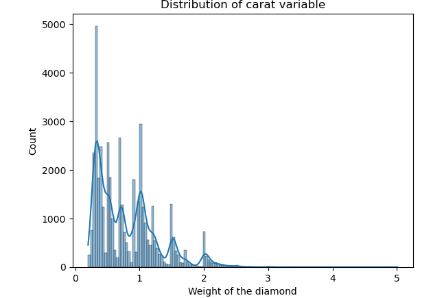
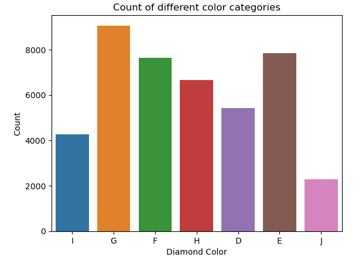
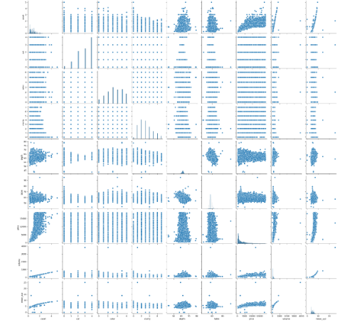
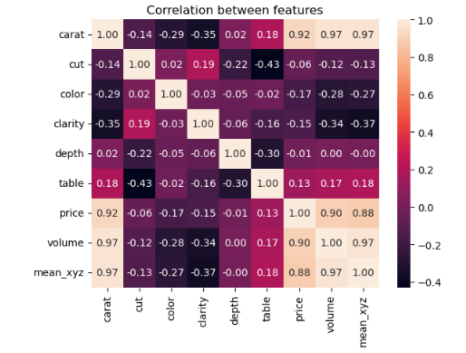
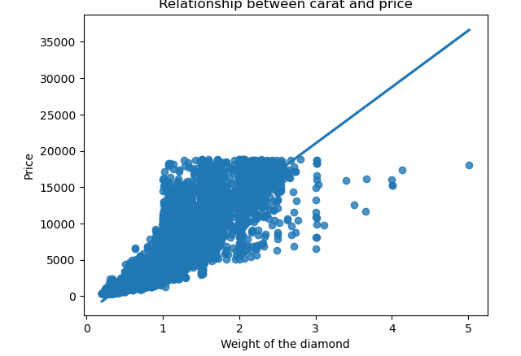
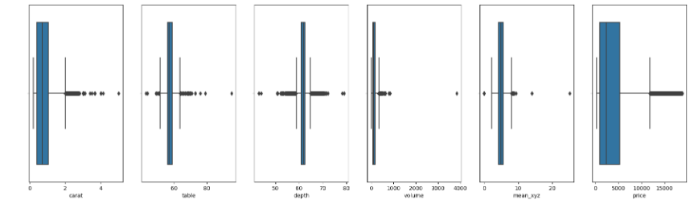

# Diamond Price Prediction Project : Project Overview
* Created a regression project that aims to predict diamond prices based on their natural characteristics with a testing RMSE score equals to 361.12.
* Collected the data to work with from kaggle website (from a competition called `Diamond Price Prediction`) already divided in train and test sets.
* Cleaned data up and engineered features so they will help us in the prediction process like calculating a diamond's volume according to its three dimensions.
* Optimized Linear Regression, Polynomial Linear Regression, Support Vector Regression, Decision Tree Regression, Random Forest Regression, XgBoost, Gradient Boosting Regression, K-Nearest Neighbors, Ridge Regression and Lasso Regression classifiers to get the best training performance and the best estimator.

## Code and Resources used
<b>Python Version :</b> 3.9 
<b>Packages :</b> Numpy, Pandas, Matplotlib, Seaborn, Scikit-learn, XgBoost 
<b>For Web Framework Requirements :</b> `pip install -r requirements.txt`

## Data Collection
Collect data from kaggle website so that training dataset has 43152 diamonds and test dataset has 10788 passengers. With each diamond, we got the folowing :
* Diamond's ID
* Weight of the diamond
* Quality of the cut (Fair, Good, Very Good, Premium, Ideal)
* Diamond colour, from J (worst) to D (best)
* A measurement of how clear the diamond is (I1 (worst), SI2, SI1, VS2, VS1, VVS2, VVS1, IF (best))
* Total depth percentage = z / mean(x, y) = 2 * z / (x + y)
* Width of top of diamond relative to widest point
* Price in US dollars
* Length in mm
* Width in mm
* Depth in mm

## Data Cleaning
Clean the data up so that it was usable for our model. I made the following changes and created the following variables:
* dropped useless features so that we are dealing with fewer data points (Diamond's ID)
* Created a feature that holds a diamond's volume
* Created a feature that holds a diamond's three dimensions mean
* Dropped diamond's dimensions as they become useless after creating volume and mean_xyz
* Encoded ordinal features and transformed them to be numerical as it's a crucial step in preprocessing phase
* Standardized and normalized float features using a standard scaler and a min-max scaler
* Removed outliers within numerical features

## EDA
I looked at the distributions of the data and the value counts for the various categorical variables to get meaningful insights from our data. Below are the visualizations I made :  
 
 
 
 
 

## Model Building
After making all those changes on the data wrangling process and because our data is already divided into training and test sets, we passed by <b>Feature Selection</b> phase using 4 different methods (Variance Threshold technique, KBest technqiue, Correlation technique & Recursive Feature Elimination technique) and tried ten different regression estimators and evaluated by calculating R-squared and RMSE performance metrics on the test data to make sure we avoided OVERFITTING in the process of prediction :
* Linear Regression
* Polynomial Linear Regression
* Support Vector Regression
* Decision Tree Regression
* Random Forest Regression
* XgBoost
* Gradient Boosting Regression
* KNN Regression
* Ridge Regression
* Lasso Regression

After getting an idea on the best estimator which can best performed on our data, we finetuned it using `GridSearchCV` to optimize our model, extract the best set of its hyperparameters and as a result minimize test RMSE score.

## Model Performance
XgBoost model had the best test RMSE score which means they are the best classifiers for our problem.
* Linear Regression : RMSE = 1282.9
* Polynomial Linear Regression : RMSE = 1020.8
* Support Vector Regression : RMSE = 2790.4
* Decision Tree Regression : RMSE = 733.63
* Random Forest Regression :  RMSE = 566.79
* XgBoost : RMSE = 361.12
* Gradient Boosting Regression : RMSE = 631.68
* KNN Regression : RMSE = 680.51
* Ridge Regression : RMSE = 1282.9
* Lasso Regression : RMSE = 1282.89
